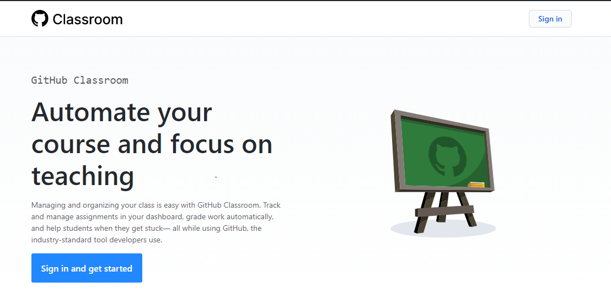
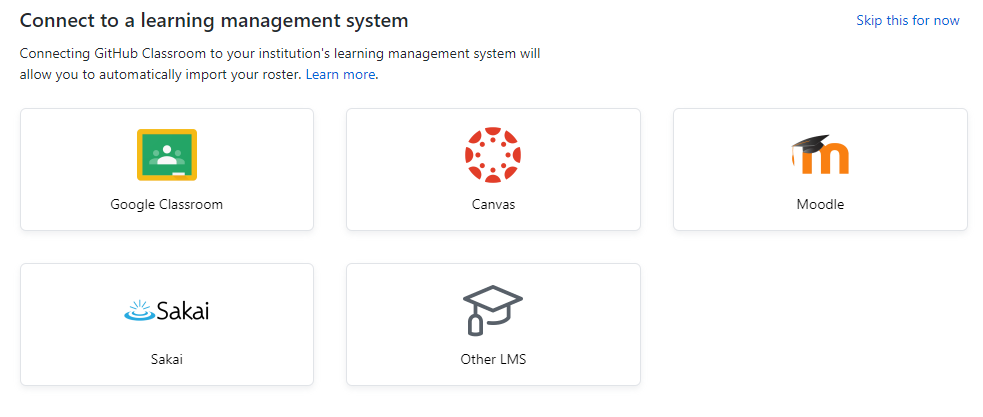
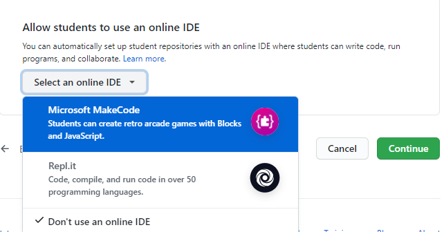
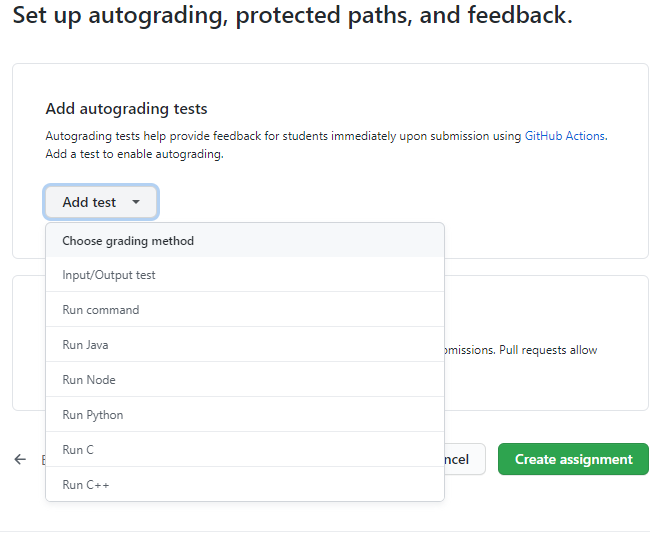

# GitHub Classroom
 

FEBRUARY 9, 2021  
Monika Sharma

 <kbd>
  
</kbd>
 

 GitHub Classroom is one of the many tools available online that allow teachers to manage and organize their classes. GitHub classroom is a product line released by GitHub in 2015[[1](https://en.wikipedia.org/wiki/Timeline_of_GitHub)]. It can primarily be used for sending out assignments to the students, provide them with the starter code and feedback. It requires the users, which can either be teachers, students, or TAs, to have prior knowledge of how GitHub works and what is it used for.

 To use the GitHub classroom, teachers need to work with GitHub and GitHub Classroom in parallel. Teachers and students need to first sign up on GitHub. Teachers can then use the same account for GitHub Classrooms to manage their classes. First, an organization is created in GitHub which is nothing but an umbrella under which various classrooms can be created along with some high-level settings. After that, a repository can be created before publishing any assignment. This repository will contain all the starter code which can be used as a base code by the students while solving the assignment. Once this is all set up, teachers can then Sign in to the GitHub classroom and create a classroom by selecting one of the organizations they have created in their GitHub account. While creating a classroom, they also have an option to invite TA's and admins to the organization. After the invitation, they also need to send a URL (of the classroom) to join the classroom, which seems to be redundant. One of the interesting features provided by GitHub classroom is the integration with third-party Learning Management Systems such as Google Classroom, Canvas, Sakai, etc. This integration allows the automatic import of the roster to the class. Alternatively, they can also add the student roster manually or by uploading CSV/text files.
 
<kbd>
  
</kbd>

 After creating the classroom, assignments can be created for that particular classroom. An assignment can be configured by setting the title of the assignment, its deadline (i.e. date & time), and selecting whether it is an individual assignment or group assignment. Teachers can then link their repository that contains boilerplate code with the assignment. There is another interesting feature available that allows teachers to integrate one of the two online IDEs i.e. Microsoft MakeCode or Repl.it with an assignment. The URL of the assignment is then shared with the students of the class via email or some other mode of communication because GitHub or GitHub classroom does not have any provision to do so.

<kbd>
  
</kbd>

 Autograding feature is of the GitHub classroom can be used to set test cases by adding inputs and corresponding outputs along with the setup and run command while creating the assignment. To ensure that any test case does not run infinitely, the timeout option is used. Points earned for each passed test case can be added while creating the test case.

<kbd>
  
</kbd>

 For every student (or group if it is a group assignment) that accepts this assignment, a repository will be created under the student's account. The repository can be public or private as selected by the teacher while creating the assignment. Students can then download the starter code in their repository and start making changes to the code. If an online IDE has been linked with the assignment, students can open that IDE from README.md and work on it. Once the assignment is done, students can commit changes to the repository which will make the changes visible to the teacher. The teacher can provide feedback and grades (if autograding feature is not used) to the students for that particular assignment.

GitHub classroom is most suitable for CS students who have prior knowledge of GitHub and know its purpose. Codesharing becomes easier with this tool and people who enjoy coding will love it. It allows continuous feedback from teachers. Teachers can easily assess the contribution of each individual in a group project and also see graphical insights of their performance in GitHub. Procrastinators need to be careful because teachers can see the time and progress of their assignments anytime.

Following are the websites which can help users to get started with GitHub Classroom and to get in touch with its support team.
* https://education.github.community/ to interact with other teachers who are using this tool.
* https://docs.github.com/en/education contains all the documentation.
* https://lab.github.com/ to learn more about GitHub and its product lines.
* https://support.github.com/contact/education to contact with GitHub support.

<h6>[References]</h6>
[1] https://en.wikipedia.org/wiki/Timeline_of_GitHub 
